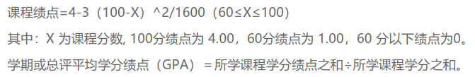

# HUST-GPA

### 华中科技大学 GPA计算

包括

* 华中科技大学算法

  

* 标准算法

  

* 北大算法

  


### 使用方法

hub系统打印成绩, excel格式, 不要分页(由于分页可能会缺失最后的备注而无法判断是否是公选), 2003或者2007均可, 支持单学期以及总成绩(打印的时候选择就好)

```shell
python HUST-GPA.py path_to_your_excel
```

输出三种计算方法下的GPA


并在脚本所在文件夹创建名为`result.json`的文件,包括所有课程信息以及最终的计算结果(期中`subGPA`只在非公选课且成绩为数字才为正常值,否则各项为空字符串)

```json
{
    "course_info" :[
        {
            "course": "courseName",
            "grade": "gradeValue",
            "credit": 1.0,
            "subGPA": {
              "HUST": 0,
              "Standard": 0,
              "PKU": 0
            },
            "year": "1",
            "is_optional": false
        },
        {
        
        }, 
		{
            
        },
    ],
	"GPA": {
        "HUST": 2.0,
        "Standard": 2.0,
        "PKU": 2.0
    }
}
```

### 依赖

`pandas`

`numpy`